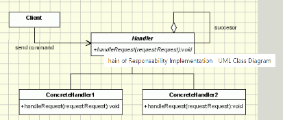

## Chain Of Responsibility Design Pattern

<pre>

   Chain of Responsibility is a behavioral design pattern that lets you 
   pass requests along a chain of handlers. Upon receiving a request, 
   each handler decides either to process the request or to pass it to 
   the next handler in the chain.

   In object-oriented design, the chain-of-responsibility pattern is a 
   behavioral design pattern consisting of a source of command objects 
   and a series of processing objects. Each processing object contains 
   logic that defines the types of command objects that it can handle; 
   the rest are passed to the next processing object in the chain. 
   A mechanism also exists for adding new processing objects to the end 
   of this chain.

</pre>

#### Concept

* Decoupling of sender and receiver
* Receiver contains reference to next receiver
* Promotes loose coupling
* No Handler - OK
  * Examples:
    * java.util.logging.Logger#log()
    * javax.servlet.Filter#doFilter()
    * Spring Security Filter Chain
#### Design

UML class diagram 

<pre>

   Handler - defines an interface for handling requests

   RequestHandler - handles the requests it is responsible for
   If it can handle the request it does so, otherwise it sends the 
   request to its successor

   Client - sends commands to the first object in the chain that may 
   handle the command

</pre>

## Advantage & Disadvantage

* Handling/Handler guarantee
* Runtime configuration risk
* Chain length/performance issues