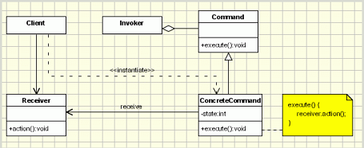

## Command Design Pattern

<pre>

   In object-oriented programming, the command pattern is a behavioral design pattern 
   in which an object is used to encapsulate all information needed to perform an action 
   or trigger an event at a later time. This information includes the method name, 
   the object that owns the method and values for the method parameters.

   Four terms always associated with the command pattern are 
   command, receiver, invoker and client. 
   A command object knows about receiver and invokes a method of the receiver. 
   Values for parameters of the receiver method are stored in the command. 
   The receiver object to execute these methods is also stored in the command 
   object by aggregation. 
   The receiver then does the work when the execute() method in command is called.  
   An invoker object knows how to execute a command, and optionally does bookkeeping
   about the command execution. The invoker does not know anything about a concrete
   command, it knows only about the command interface. Invoker object(s), command 
   objects and receiver objects are held by a client object, the client decides which 
   receiver objects it assigns to the command objects, and which commands it assigns to 
   the invoker. The client decides which commands to execute at which points. To execute 
   a command, it passes the command object to the invoker object

   In command pattern, 
   the request is send to the invoker and invoker pass it to the encapsulated command object. 
   Command object passes the request to the appropriate method of Receiver to perform the 
   specific action. 
   The client program create the receiver object and then attach it to the Command. Then it 
   creates the invoker object and attach the command object to perform an action. 
   Now when client program executes the action, it’s processed based on the command and receiver 
   object.

   - encapsulate a request in an object
   - allows the parameterization of clients with different requests
   - allows saving the requests in a queue

</pre>

#### Concept

* Encapsulate request as an Object
* Object-oriented callback
* Decouple sender from processor
* Often used for “undo” functionality
  * Examples:
    * java.lang.Runnable
    * javax.swing.Action
#### Design

UML class diagram 

<pre>

   - Command - declares an interface for executing an operation;

   - ConcreteCommand - extends the Command interface, implementing 
     the Execute method by invoking the corresponding operations on 
     Receiver. It defines a link between the Receiver and the action.

   - Client - creates a ConcreteCommand object and sets its receiver;

   - Invoker - asks the command to carry out the request;

   - Receiver - knows how to perform the operations;

</pre>

## Advantage & Disadvantage

* Dependence on other patterns
* Multiple Commands
* Make use of Memento
* Prototype for copies