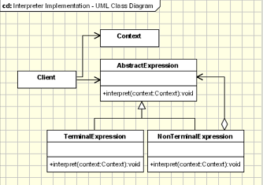

## Interpreter Design Pattern

<pre>

   - Given a language, define a representation for its grammar along with an 
     interpreter that uses the representation to interpret sentences in the language.
   - Map a domain to a language, the language to a grammar, and the grammar to a 
     hierarchical object-oriented design

</pre>

#### Concept

* Represent grammar
* Interpret a sentence
* Map a domain
* AST
  * Examples:
    * java.util.Pattern
    * java.text.Format

#### Design

UML class diagram 

<pre>
  The Template Method pattern should be used:
    - The Interpreter pattern is used exhaustively in defining grammars, 
      tokenize input and store it.
    - A specific area where Interpreter can be used are the rules engines.
    - The Interpreter pattern can be used to add functionality to the composite pattern.
</pre>

## Advantage & Disadvantage

* Complexity
* Class per rule
* Use of other patterns
* Adding new variant
* Specific case