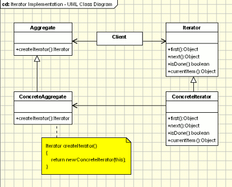

## Iterator Design Pattern

<pre>

   Provide a way to access the elements of an aggregate object sequentially 
   without exposing its underlying representation.
</pre>

#### Concept

* Traverse a container
* Doesn’t expose underlying structure
* Decouples algorithms
* Sequential
  * Examples:
    * java.util.Iterator
    * java.util.Enumeration

#### Design

UML class diagram 

## Advantage & Disadvantage

* Access to Index
* Directional
* Speed / Efficiency