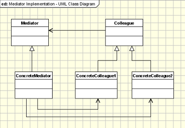

## Mediator Design Pattern
<pre>
    Mediator is a behavioral design pattern that lets you reduce chaotic 
    dependencies between objects. 
    The pattern restricts direct communications between the objects and 
    forces them to collaborate only via a mediator object.

    In software engineering, the mediator pattern defines an object that 
    encapsulates how a set of objects interact. This pattern is considered 
    to be a behavioral pattern due to the way it can alter the program's 
    running behavior.

    Define an object that encapsulates how a set of objects interact. Mediator 
    promotes loose coupling by keeping objects from referring to each other 
    explicitly, and it lets you vary their interaction independently.

</pre>

#### Concept
* Loose coupling
* Well-defined, but complex
* Reusable components
* Hub / Router
  * Examples:
    * java.util.Timer
    * java.lang.reflect.Method#invoke()
#### Design

UML class diagram 

<pre>

    The participants classes in this pattern are:
    Mediator - defines an interface for communicating with Colleague objects.
    ConcreteMediator - knows the colleague classes and keep a reference to the 
    colleague objects.
    - implements the communication and transfer the messages between the colleague classes
    Colleague classes - keep a reference to its Mediator object
    - communicates with the Mediator whenever it would have otherwise communicated with 
    another Colleague.

</pre>
## Advantage & Disadvantage

* Deity object
* Limits subclassing
* Over or with Command