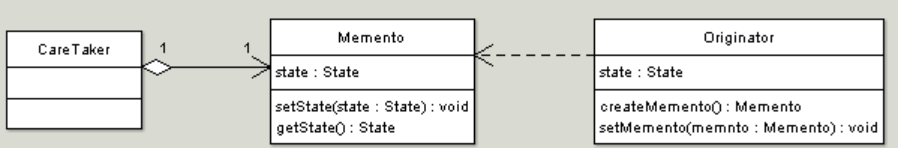

## Memento Design Pattern

<pre>

   Memento is a behavioral design pattern that lets you save and restore 
   the previous state of an object without revealing the details of its 
   implementation.

   The intent of this pattern is to capture the internal state of an object 
   without violating encapsulation and thus providing a mean for restoring 
   the object into initial state when needed.

</pre>

#### Concept

* Restore Object to previous state
* Externalize internal state
* Undo/Rollback
* Shields complex internals
  * Examples:
    * java.util.Date
    * java.io.Serializable

#### Design

UML class diagram 

<pre>

    Memento
      Stores internal state of the Originator object. The state can include 
      any number of state variables.
      The Memento must have two interfaces, an interface to the caretaker. 
      This interface must not allow any operations or any access to internal 
      state stored by the memento and thus honors encapsulation. The other 
      interface is to the originator and allows the originator to access any 
      state variables necessary to for the originator to restore previous state.
    Originator
      Creates a memento object capturing the originators internal state.
      Use the memento object to restore its previous state.
    Caretaker
      Responsible for keeping the memento.
      The memento is opaque to the caretaker, and the caretaker must not operate on it.

</pre>

## Advantage & Disadvantage

* Can be expensive
* Deletes/history
* Exposing information