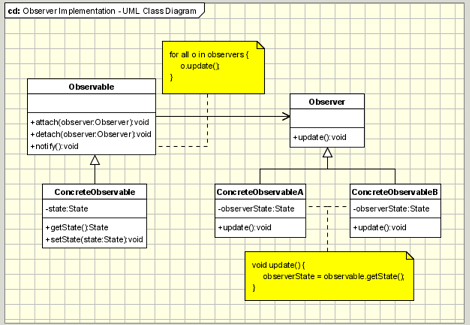

## Observer Design Pattern
<pre>

  In software design and engineering, the observer pattern is a 
  software design pattern in which 
  an object, named the subject, 
  maintains a list of its dependents, called observers, 
  and notifies them automatically of any state changes, 
  usually by calling one of their methods.

  Defines a one-to-many dependency between objects so that 
  when one object changes state, all its dependents are notified 
  and updated automatically.

</pre>

#### Concept

* One to Many
* Decoupled
* Event Handling
* Pub/Sub
* M-V-C
  * Examples:
    * java.util.Observer
    * java.util.EventListener
    * javax.jms.Topic

#### Design

UML class diagram

<pre>
   The participants classes in this pattern are:

   Observable - interface or abstract class defining the operations 
   for attaching and de-attaching observers to the client. 
   In the GOF book this class/interface is known as Subject.

   ConcreteObservable - concrete Observable class. It maintain the state 
   of the object and when a change in the state occurs it notifies the 
   attached Observers.

   Observer - interface or abstract class defining the operations to be 
   used to notify this object.
   ConcreteObserverA, ConcreteObserver2 - concrete Observer implementations.
</pre>

## Advantage & Disadvantage

* Unexpected updates
* Large sized consequences
* What changed
* Debugging difficult
<pre>

Benefits of Using the Observer Pattern:

LooseCoupling — the subject does not need to know anything about the observers. Subject only knows nothing more than that the observer implements the Observer interface.
It allows sending data to other objects effectively without any change in the Subject or Observer classes.
Observers can be added/removed at any point in time.

Drawbacks of Using Observer Pattern:

The subject may send updates that do not matter to the observer.
It has a risk to implement. If it is not implemented carefully, it will be the cause of large code complexity.
Subscribers are notified in random order.
The memory leakage problem in the observer design pattern because of the observer’s explicit register and unregistering.

</pre>