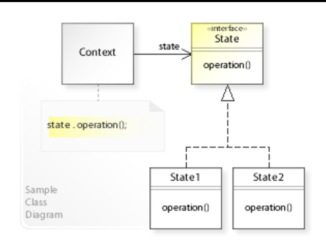

## State Design Pattern

<pre>
  
   The state pattern is a behavioral software design pattern that allows 
   an object to alter its behavior when its internal state changes.

</pre>

#### Concept

* Localize state behavior
* State Object
* Separates What from Where
* OCP
* Examples:
  * None!
  * JSF
  * Iterator

#### Design

UML class diagram 

## Advantage & Disadvantage

* Know your States
* More classes
* Keep logic out of Context
* State change triggers