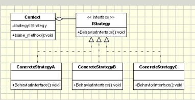

## Strategy Design Pattern
<pre>

   The Strategy pattern defines a family of algorithms, 
   encapsulates each one, 
   and makes them interchangeable. 
   Strategy lets the algorithm vary independently from the clients that use it

   In computer programming, the strategy pattern 
   (also known as the policy pattern) 
   is a behavioral software design pattern that enables 
   selecting an algorithm at runtime. 
   Instead of implementing a single algorithm directly, 
   code receives run-time instructions as to which in a family of algorithms to use.
   Strategy lets the algorithm vary independently from clients that use it.

</pre>
#### Concept
* Eliminate conditional statements
* Behavior encapsulated in classes
* Difficult to add new strategies
* Client aware of strategies
* Client chooses strategy
  * Examples: 
    java.util.Comparator

#### Design

UML class diagram

<pre>

Strategy - defines an interface common to all supported algorithms. 
           Context uses this interface to call the algorithm defined 
           by a ConcreteStrategy.
ConcreteStrategy - each concrete strategy implements an algorithm.
Context
  -- contains a reference to a strategy object.
  -- may define an interface that lets strategy accessing its data.

</pre>

## Advantage & Disadvantage

* Client aware of Strategies
* Increased number of classes