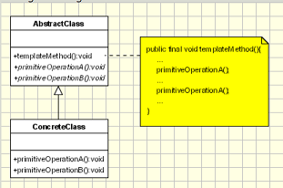

## Template Design Pattern

<pre>

   - Define the skeleton of an algorithm in an operation, 
     deferring some steps to subclasses.
   - Template Method lets subclasses redefine certain steps of an algorithm 
     without letting them to change the algorithm's structure.

</pre>

#### Concept

* Code reuse
* Common in libraries/frameworks
* IoC
* Algorithm emphasis
  * Examples:
    * java.util.Collections#sort()
    * java.util.AbstractList#indexOf()

#### Design

UML class diagram 

<pre>
AbstractClass - defines abstract primitive operations that concrete subclasses define to implement steps of an algorithm.
- implements a template method which defines the skeleton of an algorithm. The template method calls primitive operations as well as operations defined in AbstractClass or those of other objects.
ConcreteClass - implements the primitive operations to carry out subclass-specific steps of the algorithm
</pre>

## Advantage & Disadvantage

* Restrict access
* Confusing hierarchy
* Difficult Program flow