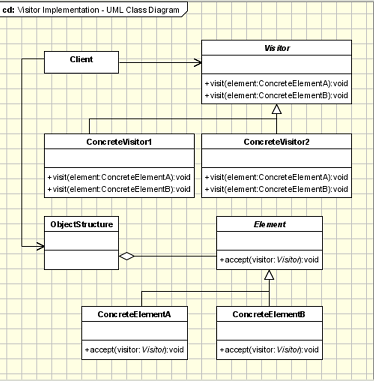

## Visitor Design Pattern

<pre>

@Data
p a c Client {
  p f String name; 
  p f String address; 
  p f String number; 
}
@Getter
p c Resident extends Client{
  p f String insuranceClass;
  p Resident(String name, String address, String number, String insuranceClass) {
     super(name, address, number);
     this.insuranceClass = insuranceClass;
  }
}
@Getter
p c Company extends Client{
  p f String nbrOfEmployees;
  p Company(String name, String address, String number, String nbrOfEmployees) {
     super(name, address, number);
     this.nbrOfEmployees = nbrOfEmployees;
  }
}
@Getter
p c Bank extends Client{
  p f String branchesInsured;
  p Bank(String name, String address, String number, String branchesInsured) {
     super(name, address, number);
     this.branchesInsured = branchesInsured;
  }
}
@Getter
p c Restaurant extends Client{
  p f String availableAbroad;
  p Restaurant(String name, String address, String number, String availableAbroad) {
     super(name, address, number);
     this.availableAbroad = availableAbroad;
  }
}

New requirement
Add messaging functionality - based on the client particular mail will be sent for insurance deal
Resident - Medical insurance
Bank     - theft insurance

@Data
p a c Client {
  p f String name; 
  p f String address; 
  p f String number; 
  p v sendMail(){};
}
We violated SRP and OCP
Solution - Separate these behaviors outside of client classes on which they operate

public interface Visitor {
    void visit(Bank bank);
    void visit(Company company);
    void visit(Resident resident);
    void visit(Restaurant restaurant);
}

public class InsuranceMessagingVisitor implements Visitor {
    public void sendInsuranceMails(List<Client> clients) {
        for (Client client : clients) {
            //visit(client); Can't resolve method. without accept method
            // Double Dispatch - Delegates choosing the proper method
            // to the object itself instead of letting the client select 
            // a method
            client.accept(this);
        }
    }

    public void visit(Bank bank) {
        System.out.println("Sending mail about theft insurance to " + bank.getName());
    }

    public void visit(Company company) {
        System.out.println("Sending employees and equipment insurance mail to " + company.getName());
    }

    public void visit(Resident resident) {
        System.out.println("Sending mail about medical insurance to " + resident.getName());
    }

    public void visit(Restaurant restaurant) {
        System.out.println("Sending mail about fire and food insurance to " + restaurant.getName());
    }
}

@Data
public abstract class Client {

    private final String name;
    private final String address;
    private final String number;
    public abstract void accept(Visitor visitor);
}

@Getter
public class Resident extends Client {

    private final String insuranceClass;

    public Resident(String name, String address, String number, String insuranceClass) {
        super(name, address, number);
        this.insuranceClass = insuranceClass;
    }

    @Override
    public void accept(Visitor visitor) {
        visitor.visit(this);
    }
}
</pre>

<pre>

   In object-oriented programming and software engineering, the visitor design 
   pattern is a way of 
   separating an algorithm from an object structure on which it operates. 
   A practical result of this separation is the ability to add new 
   operations to existing object structures without modifying the structures.
   It is one way to follow the open/closed principle.

</pre>

#### Concept

* Separate Algorithm from Object
* Adding new features
* Maintain Open/Closed principle
* Visitor changes
  * Examples:
  * java.lang.model.element.Element
  * java.lang.model.element.ElementVisitor
#### Design

UML class diagram 

<pre>

    Visitor - This is an interface or an abstract class used to declare the visit 
    operations for all the types of visitable classes. Usually the name of the 
    operation is the same and the operations are differentiated by the method 
    signature: The input object type decides which of the method is called.

    ConcreteVisitor - For each type of visitor all the visit methods, declared in 
    abstract visitor, must be implemented. Each Visitor will be responsible for different 
    operations. When a new visitor is defined it has to be passed to the object structure.

    Visitable - is an abstraction which declares the accept operation. This is the entry
    point which enables an object to be "visited" by the visitor object. Each object from 
    a collection should implement this abstraction in order to be able to be visited.

    ConcreteVisitable - Those classes implements the Visitable interface or class and defines 
    the accept operation. The visitor object is passed to this object using the accept operation.
    ObjectStructure - This is a class containing all the objects that can be visited. It offers a 
    mechanism to iterate through all the elements. This structure is not necessarily a collection. 
    In can be a complex structure, such as a composite object.
</pre>

## Advantage & Disadvantage

* Plan for adaptability
* Indirection somewhat confusing
* Adapter pattern

https://www.youtube.com/watch?v=UQP5XqMqtqQ
https://github.com/geekific-official/geekific-youtube