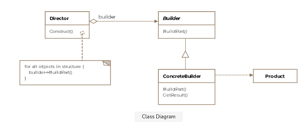

## Builder Design Pattern

<pre>

  The builder pattern is a design pattern designed to provide a flexible
  solution to various object creation problems in object-oriented programming.

  The intent of the Builder design pattern is to separate the construction 
  of a complex object from its representation.

  — Wikipedia

  Separate the construction of a complex object from its representation so 
  that the same construction process can create different representations

  — Design Patterns: Elements of Reusable Object-Oriented Software

  The builder pattern lets you construct complex objects step by step. It 
  allows you to produce different types and representations of a product using 
  the same construction code. However, this pattern should be used only if you
  need to build different immutable objects using the same building process.

</pre>
<pre>

  The Builder pattern differs not very much from Abstract Factory pattern. While the 
  Builder pattern focuses on constructing a complex object step by step, 
  the Abstract Factory pattern emphasizes a family of Product objects, either simple 
  or complex. Whereas the Builder pattern returns the final Product as a last step, 
  the Abstract Factory pattern returns the Product immediately.

</pre> 

#### Concept

* Handles complex constructors
* Large number of parameters
* Immutability
* Examples:
    * StringBuilder
    * DocumentBuilder
    * Locale.Builder

#### Design

UML class diagram

<pre>
The participants classes in this pattern are:
   * The Builder class specifies an abstract interface for creating parts of a 
     Product object.
   * The ConcreteBuilder constructs and puts together parts of the product by 
     implementing the Builder interface. It defines and keeps track of the representation 
     it creates and provides an interface for saving the product.
   * The Director class constructs the complex object using the Builder interface.
   * The Product represents the complex object that is being built.
</pre>
<pre>

  Bloch’s version of the Builder pattern provides a simple and safe way to build objects 
  that have many optional parameters, so it addresses the telescoping constructor problem 
  (which I describe shortly). In addition, with large constructors, which in most cases 
  have several parameters of the same type, it is not always obvious which value belongs to 
  which parameter. Therefore, the likelihood of mixing up parameter values is high.

  The idiom used by Bloch’s Builder pattern addresses these issues by creating a static inner 
  Builder class that can be accessed without creating an instance of the outer class (the product 
  being built) but that still has access to the outer private constructor.

</pre>
<pre>
    import builder.pattern.Genre;
    import java.time.Year;
    
    public class Book {
        private final String isbn;
        private final String title;
        private final Genre genre;
        private final String author;
        private final Year published;
        private final String description;
        public Book(String isbn, String title, Genre genre, String author, Year published, String description) {
            this.isbn = isbn;
            this.title = title;
            this.genre = genre;
            this.author = author;
            this.published = published;
            this.description = description;
        }
        // Getter
    }

    Further, the Book class has two mandatory fields: ISBN, which refers to a 
    book’s 10-digit or 13-digit International Standard Book Number, and Title. 
    All remaining fields are optional.

    Now the question arises, how can you construct objects with different combinations 
    of optional parameters by using an appropriate constructor for each given combination? 
    Because the objects are intended to be immutable, Enterprise JavaBean–like setters 
    are out of question.
    
    One possible solution consists of telescoping constructors.
    where the first constructor takes only the mandatory fields; for every optional field, 
    there is a further constructor that takes the mandatory fields plus the optional fields. 
    Every constructor calls the subsequent one by passing a null value in place of the missing 
    parameter. Only the final constructor in the chain will set all the fields by using the 
    values provided by the parameters.
    
    import builder.pattern.Genre;
    import java.time.Year;

    public class Book {
        private final String isbn;
        private final String title;
        private final Genre genre;
        private final String author;
        private final Year published;
        private final String description;
    
        public Book(String isbn, String title) {
            this(isbn, title, null);
        }
    
        public Book(String isbn, String title, Genre genre) {
            this(isbn, title, genre, null);
        }
    
        public Book(String isbn, String title, Genre genre, String author) {
            this(isbn, title, genre, author, null);
        }
    
        public Book(String isbn, String title, Genre genre, String author, Year published) {
            this(isbn, title, genre, author, published, null);
        }
    
        public Book(String isbn, String title, Genre genre, String author, Year published, String description) {
            this.isbn = isbn;
            this.title = title;
            this.genre = genre;
            this.author = author;
            this.published = published;
            this.description = description;
        }
        // Getter
    }

    Unfortunately, the telescoping constructors will not prevent you from having to pass null 
    values in some cases. For instance, if you had to create a Book with ISBN, title, and author, 
    what would you do? There is no such constructor!

    You would probably use an existing constructor and pass a null value in place of the missing 
    parameter.

    new Book("0-12-345678-9", "Moby-Dick", null, "Herman Melville");

    However, the use of null values can be avoided by creating an appropriate constructor, as follows:

    public Book(String isbn, String title, String author) {
        this.isbn = isbn;
        this.title = title;
        this.author = author;
    }
   
    The resulting constructor call should work fine but may lead to a different problem.

    new Book("0-12-345678-9", "Moby-Dick", "Herman Melville");

    Imagine you also had to create a Book with ISBN and title but with description instead of author. 
    You might be tempted to add a constructor like the following:

    public Book(String isbn, String title, String description) {
        this.isbn = isbn;
        this.title = title;
        this.description = description;
    }

    This would not work. Two constructors of the same signature cannot coexist in the same class, 
    because the compiler would not know which one to choose. In addition, creating a constructor 
    for every useful combination of parameters would result in a large combination of constructors, 
    making the resulting code hard to read and even harder to maintain.

    Therefore, neither telescoping constructors nor any other possible combination of constructor 
    parameters is a good approach to solve the issues related to the construction of objects that 
    have numerous optional fields.

    This is where Bloch’s version of the Builder pattern comes in.

    import builder.pattern.Genre;
    import java.time.Year;
    
    public class Book {
        private final String isbn;
        private final String title;
        private final Genre genre;
        private final String author;
        private final Year published;
        private final String description;
        private Book(Builder builder) {
            this.isbn = builder.isbn;
            this.title = builder.title;
            this.genre = builder.genre;
            this.author = builder.author;
            this.published = builder.published;
            this.description = builder.description;
        }
    
        public String getIsbn() {
            return isbn;
        }
    
        public String getTitle() {
            return title;
        }
    
        public Genre getGenre() {
            return genre;
        }
    
        public String getAuthor() {
            return author;
        }
    
        public Year getPublished() {
            return published;
        }
    
        public String getDescription() {
            return description;
        }
    
        public static class Builder {
            private final String isbn;
            private final String title;
            private Genre genre;
            private String author;
            private Year published;
            private String description;
    
            public Builder(String isbn, String title) {
                this.isbn = isbn;
                this.title = title;
            }
    
            public Builder genre(Genre genre) {
                this.genre = genre;
                return this;
            }
    
            public Builder author(String author) {
                this.author = author;
                return this;
            }
    
            public Builder published(Year published) {
                this.published = published;
                return this;
            }
    
            public Builder description(String description) {
                this.description = description;
                return this;
            }
    
            public Book build() {
                return new Book(this);
            }
    
        }
    }

    The following are some things to note:

       * The scope of the Book constructor has been changed to private, so that it 
         cannot be accessed from the outside of the Book class. This makes it impossible 
         to create a Book instance directly. The object creation process is delegated to 
         the Builder class.
       * The Book constructor takes a Builder instance as its only parameter, which contains 
         all the values to be set by the Book constructor. Alternatively, the Book constructor 
         could take all the parameters corresponding to the Book fields, but this would mean 
         that you must deal again with many parameters to be set in the right order when you 
         call the Book constructor from the Builder’s build method. Mixing up parameters of the 
         same type is one of the potential issues developers try to avoid by implementing the Builder 
         pattern.
       * The Builder class contains the same fields as the Book class, which is necessary to hold 
         the values to be passed to the Book constructor. This has often been rightly criticized 
         as code duplication.
       * For every optional field to be set, the Builder class exposes a setter-like method, which 
         assigns the field’s value and returns the current Builder instance to build the object in 
         a fluent way. Since each method call returns the same Builder instance, method calls can 
         be chained, which makes the client code more concise and readable.
       * The build method calls the Book constructor by passing the current Builder instance as the 
         only parameter. The values held by the Builder instance are then unpacked by the Book 
         constructor, which assigns them to the corresponding Book fields.

        Book book = new Book.Builder("0-12-345678-9", "Moby-Dick")
                .genre(Genre.ADVENTURE_FICTION)
                .author("Herman Melville")
                .published(Year.of(1851))
                .description(
                        "The book is the sailor Ishmael's narrative of the obsessive quest of "
                        + "Ahab, captain of the whaling ship Pequod, for revenge on Moby Dick, "
                        + "the giant white sperm whale that on the ship's previous voyage bit "
                        + "off Ahab's leg at the knee."
                )
                .build();   

       Reusability and limitations
       ===========================

        Book.Builder bookBuilder = new Book.Builder("0-12-345678-9", "Moby-Dick")
                        .genre(Genre.ADVENTURE_FICTION)
                        .author("Herman Melville")
                        .published(Year.of(1851))
                        .description("description omitted for brevity");
        
        // Create a first Book object
        Book book = bookBuilder.build();
        
        // Create a second, slightly different, object reusing the same Builder instance
        book = bookBuilder.published(Year.of(1952)).build();
   
       State validation
       ================

       Bloch’s Builder pattern also allows for convenient state validation during the 
       construction process of the Product instance. Since all the Book fields are final, 
       and thus can’t be changed after a Book instance has been created, the state needs 
       to be validated only once, specifically at construction time. The validation logic 
       can be implemented (or called) either in the Builder’s build method or in the Book 
       constructor. In the following example, the logic is called from the build method:

       private void validate() throws IllegalStateException {
            MessageBuilder mb = new MessageBuilder();
            if (isbn == null) {
                mb.append("ISBN must not be null.");
            } else if (!isbnValidator.isValid(isbn)) {
                mb.append("Invalid ISBN!");
            }
            if (title == null) {
                mb.append("Title must not be null.");
            } else if (title.length() < 2) {
                mb.append("Title must have at least 2 characters.");
            } else if (title.length() > 100) {
                mb.append("Title cannot have more than 100 characters.");
            }
            if (author != null && author.length() > 50) {
                mb.append("Author cannot have more than 50 characters.");
            }
            if (published != null && published.isAfter(Year.now())) {
                mb.append("Year published cannot be greater than current year.");
            }
            if (description != null && description.length() > 500) {
                mb.append("Description cannot have more than 500 characters.");
            }
            if (mb.length() > 0) {
                throw new IllegalStateException(mb.toString());
            }
        }
</pre>

## Advantage & Disadvantage

***Advantage***

* Objects can be created step-by-step.
* The creation of an object can be postponed until all the necessary information
  for the construction of the same is available. The object will not be obtained
  until the build method of the Builder class is executed.
* Clean code: The Single Responsibility Principle (SRP) is applied, since the complex
  construction of the object is isolated from the business logic of this object. 

***Disadvantage***

* The main drawback of the builder pattern is the increased complexity in the code
  and the increased number of classes required. This a well-known disadvantage when
  applying design patterns — the price that must be paid to gain abstraction in the code.

