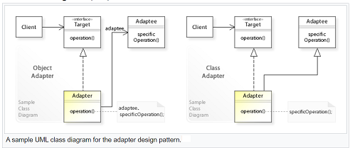

## Adapter Pattern

<pre>
   An Adapter pattern acts as a connector between two incompatible 
   interfaces that otherwise cannot be connected directly.

   it's great pattern to connecting new code with legacy code

   In software engineering, the adapter pattern is a software design 
   pattern (also known as wrapper, an alternative naming shared with 
   the decorator pattern) that allows the interface of an existing class 
   to be used as another interface. It is often used to make existing 
   classes work with others without modifying their source code.
</pre>

#### Concept

* Plug adaptor
* Convert interface into another interface
* Legacy
* Translates requests
* Client, Adapter, Adaptee
* Examples:
    * Arrays -> Lists
    * Streams

#### Design

UML class diagram

<pre>
   The classes/objects participating in adapter pattern:

    Target - defines the domain-specific interface that Client uses.

    Adapter - adapts the interface Adaptee to the Target interface.

    Adaptee - defines an existing interface that needs adapting.

    Client - collaborates with objects conforming to the Target interface.
   In the above UML class diagram, the client class that requires a target 
   interface cannot reuse the adaptee class directly because its interface 
   doesn't conform to the target interface.
   Instead, the client works through an adapter class that implements the 
   target interface in terms of adaptee:

   The Object Adapter way implements the target interface by delegating to an 
   adaptee object at run-time (adaptee.specificOperation()).

   The Class Adapter way implements the target interface by inheriting from an 
   adaptee class at compile-time (specificOperation()).
</pre>

#### Pitfall

Not a lot!
Don't complicate
Multiple Adapters
Don't add functionality

#### Contrast

<Pre>
       Adapter                             Bridge
       ▪ Works after code is designed      ▪ Designed upfront
       ▪ Legacy                            ▪ Abstraction and implementation vary
       ▪ Retrofitted                       ▪ Built in advance
       ▪ Provides different interface      ▪ Both adapt multiple systems
</Pre>