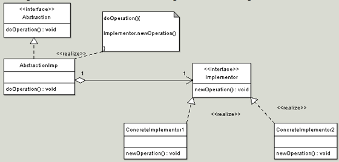

## Bridge

<pre>
    The intent of this pattern is to decouple abstraction from 
    implementation so that the two can vary independently

    The bridge design pattern is very similar to adapter pattern

    The bridge works with new code whereas adapter works with 
    legacy code
</pre>

#### Concept

Decouple Abstraction and implementation
The bridge uses encapsulation, aggregation, and can  
use inheritance to separate responsibilities into    
different classes.
Changes in Abstraction won’t affect client
Details won’t be right
Examples:
Driver
JDBC

#### Design

UML class diagram

#### The participants class in the bridge pattern are:

<Pre>
    Abstraction - Abstraction defines abstraction interface.
    AbstractionImpl - Implements the abstraction interface using 
                  a reference to an object of type Implementor.
    Implementor - Implementor defines the interface for implementation 
                  classes. This interface does not need to correspond 
                  directly to abstraction interface and can be very different.
                  Abstraction imp provides an implementation in terms of operations 
                  provided by Implementor interface.
    ConcreteImplementor1, ConcreteImplementor2 - Implements the Implementor interface.
</Pre>

#### Pitfall

Increase complexity
Conceptually difficult to plan
More than just OO
What goes where