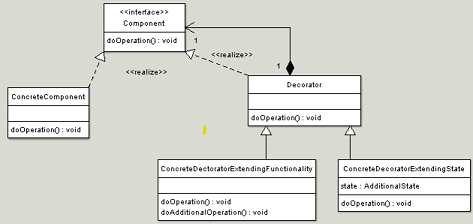

## Decorator Design Pattern

<pre>
  Extending an object's functionality can be done statically (at compile time) by 
  using inheritance however it might be necessary to extend an object's functionality 
  dynamically (at runtime) as an object is used.

  The intent of this pattern is to add additional responsibilities dynamically to an object.

  In object-oriented programming, the decorator pattern is a design pattern that allows 
  behavior to be added to an individual object, dynamically, without affecting the behavior 
  of other objects from the same class.

</pre>

#### Concept

Also called a wrapper
Add behavior without affecting others
More than just inheritance
Single Responsibility Principle
Compose behavior dynamically
Examples:
java.io.InputStream
java.util.Collections#checkedList
UI components

#### Design

UML class diagram

<pre>
  classes in the decorator pattern are:

  Component - Interface for objects that can have responsibilities 
  added to them dynamically.
  ConcreteComponent - Defines an object to which additional responsibilities 
  can be added.
  Decorator - Maintains a reference to a Component object and defines an 
  interface that conforms to Component's interface.
  Concrete Decorators - Concrete Decorators extend the functionality of the 
  component by adding state or adding behavior.
</pre>

#### Pitfall

New class for every feature added
Multiple little objects
Often confused with simple inheritance