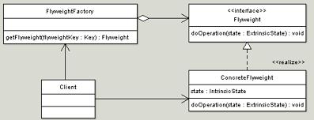

## Flyweight Pattern

<pre>

   In computer programming, the flyweight software design pattern refers to an object 
   that minimizes memory usage by sharing some of its data with other similar objects.
</pre>

## Motivation

<pre>

    Some programs require a large number of objects that have some shared state among them. 
    Consider for example a game of war, were there is a large number of soldier objects; 
    a soldier object maintain the graphical representation of a soldier, soldier behavior 
    such as motion, and firing weapons, in addition soldiers health and location on the war 
    terrain. 

    Creating a large number of soldier objects is a necessity however it would incur a huge 
    memory cost. Note that although the representation and behavior of a soldier is the same 
    their health and location can vary greatly.
  
    a. More efficient use of memory
    b. Large number of similar objects
    c. Immutable
    d. Most of the object states can be extrinsic
    e. Examples:
       java.lang.String
       java.lang.Integer#valueOf(int)
       Boolean, Byte, Character, Short, Long
</pre>

#### Design

UML class diagram

<pre>

    Flyweight - Declares an interface through which flyweights can receive and act 
    on extrinsic state.

    ConcreteFlyweight - Implements the Flyweight interface and stores intrinsic state. 
    A ConcreteFlyweight object must be sharable. The Concrete flyweight object must 
    maintain state that it is intrinsic to it, and must be able to manipulate state that 
    is extrinsic. In the war game example graphical representation is an intrinsic state, 
    where location and health states are extrinsic. Soldier moves, the motion behavior 
    manipulates the external state (location) to create a new location.

    FlyweightFactory - The factory creates and manages flyweight objects. In addition 
    the factory ensures sharing of the flyweight objects. The factory maintains a pool of 
    different flyweight objects and returns an object from the pool if it is already created, 
    adds one to the pool and returns it in case it is new.
    In the war example a Soldier Flyweight factory can create two types of flyweights : a Soldier 
    flyweight, as well as a Colonel Flyweight. When the Client asks the Factory for a soldier, 
    the factory checks to see if there is a soldier in the pool, if there is, it is returned to the 
    client, if there is no soldier in pool, a soldier is created, added to pool, and returned to the 
    client, the next time a client asks for a soldier, the soldier created previously is returned, 
    no new soldier is created.

    Client - A client maintains references to flyweights in addition to computing and maintaining 
    extrinsic state

</pre>

## Pitfalls

* Complex pattern
* Premature optimization
* Must understand Factory
* Not a graphical pattern